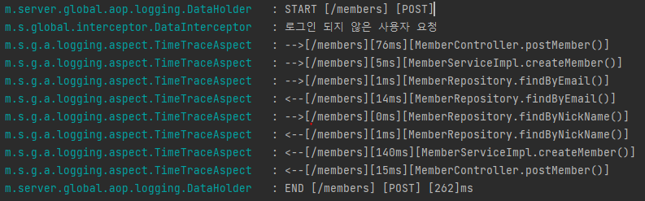

# AOP를 이용한 Logging 구현

------


## Log를 기록하게 된 이유


프로젝트를 진행하면서 기능에 관한 내용은 모든 팀이 비슷할 것이라 생각하였고,

그에 따라 저희 팀은 다른 팀과의 차별점 및 개발자로서 가져야할 기본기에 집중하였습니다.

그 중에서 가장 첫번째로 떠오른 것이 바로 서비스의 성능 최적화였습니다.

성능 최적화의 방법에는 서버 증설, 로드 밸런싱 등 여러가지 방법이 있었지만,

한계 상 API 응답속도를 줄이는 방안으로 결정되었습니다.


API의 응답속도를 확인하기 위하여 각 요청에 걸리는 시간을 확인하기 위하여 Log 기록방식을 채택하였고

OOP (객체지향 프로그래밍)으로 Log를 기록하려면 코드가 매우 난잡하고, 유지보수가 힘들다는 판단하에

AOP(관점지향 프로그래밍)으로 Log를 기록하기로 결정했습니다.


------


## AOP를 사용한 Log 기능 구현


**@TimeTrace 애너테이션**

먼저 Log를 남길 메서드들에 Pointcut을 적용할 @TimeTrace 애너테이션을 생성하였습니다.

```java
@Target(ElementType.METHOD)
@Retention(RetentionPolicy.RUNTIME)
public @interface TimeTrace {

    /**
     *  Aspect에서 log.WARN을 표시할 시간 기준 ms
     */
    int millis() default 50;

}
```

`@Target`의 ElementType을 METHOD로 설정하여 해당 애너테이션을 METHOD에 적용되게 설정하였고,

`@Retention` 을 사용하여 해당 애너테이션이 RUNTIME이 끝날때까지 유지되도록 적용하였습니다.

또한 추 후 서술할 TimeTraceAspect 클래스에서 log.WARN을 보낼 Default 소요시간을 50으로 설정하였습니다.


**DataHolder 클래스**

또한 Log 기록을 시작하고 끝내줄 DataHolder 클래스를 생성하였습니다.

```java
@Slf4j
@Component
@Scope(value = "request", proxyMode = ScopedProxyMode.TARGET_CLASS)
@Getter
@Setter
public class DataHolder extends StopWatch {

    private Long memberId;
    private List<String> roles;
    private String uri;
    private String method;

    @PostConstruct
    private void init() {
        this.start();
    }

    public void setUri(String uri) {
        this.uri = uri;
        log.info("START [{}] [{}]", uri, method);
    }

    @PreDestroy
    private void destroy() {
        this.stop();
        log.info("END [{}] [{}] [{}]ms", uri, method, this.getTotalTimeMillis());
    }
}
```

스프링빈 컨테이너의 인스턴스들은 싱글톤으로 관리되어지는데, 이를 싱글톤으로 관리하게 된다면

동시성 이슈로 인하여 로직이 제대로 작동하지 않는 문제가 발생합니다.

따라서 `@Scope(value = "request", proxyMode = ScopedProxyMode.TARGET_CLASS)` 를 작성하여

DataHolder가 생성한 인스턴스를 request마다 개별로 생성하고 응답 시 제거되도록 설정하였습니다.


또한 스프링에서 제공하는 `StopWatch` 기능을 상속받아 각각의 요청에 대한 응답까지 걸린 시간을 측정하도록 작성하였습니다.


`@PostConstruct` 애너테이션을 적용하여 요청을 받아 인스턴스가 생성될 때 StopWatch 기능 또한 작동하게 설정하였으며,

`@PreDestroy` 애너테이션으로 인스턴스가 종료되어 제거되기 전 StopWatch를 종료하고 소요시간을 기록합니다.

 

`setUri` 를 설정하여 요청이 들어왔을 때, 요청받은 Uri와 Method를 로그에 기록하도록 설정하였습니다.


**TimeTraceAspect 클래스**

```java
@Slf4j
@Aspect
@Component
public class TimeTraceAspect {

    private final DataHolder dataHolder;

    public TimeTraceAspect(DataHolder dataHolder) {
        this.dataHolder = dataHolder;
    }

    @Around("@annotation(timeTrace)")
    public Object doTimeTrace(ProceedingJoinPoint joinPoint, TimeTrace timeTrace) throws Throwable {

        String name = joinPoint.getSignature().toShortString().split("\\(")[0] + "()";
        String uri = dataHolder.getUri();
        int millis = timeTrace.millis();
        final int limitMillis = 300;

        dataHolder.stop();

        doLogTime("-->", uri, name, dataHolder.getLastTaskTimeMillis(), millis, limitMillis);

        dataHolder.start();

        Object result = joinPoint.proceed();

        dataHolder.stop();

        doLogTime("<--", uri, name, dataHolder.getLastTaskTimeMillis(), millis, limitMillis);

        dataHolder.start();

        return result;
    }

    private void doLogTime(String arrow, String uri, String name, long lastStopWatchTime,
                           int millis, int limitMillis) {
        if (lastStopWatchTime <= millis) {
            log.info(arrow + "[{}][{}ms][{}]", uri, lastStopWatchTime, name);
        } else if (lastStopWatchTime <= limitMillis) {
            log.warn(arrow + "[{}][{}ms][{}]", uri, lastStopWatchTime, name);
        } else log.error(arrow + "[{}][{}ms][{}]", uri, lastStopWatchTime, name);
    }
}
```

먼저 `@Aspect` 애너테이션을 적용하였습니다.

해당 애너테이션을 적용하게 되면 빈 후처리기에서 `@Aspect` 애너테이션을 찾아서 해당 클래스를 Advisor로 만들어줍니다.

여기서 Advisor란 Pointcut(공통 관심사를 적용할 위치) + Advice(공통 관심사를 처리할 방법)이며,

스프링빈 컨테이너에 프록시 객체로 등록됩니다.


```java
public class TimeTraceAspect {
private final DataHolder dataHolder;

public TimeTraceAspect(DataHolder dataHolder) {
    this.dataHolder = dataHolder;
}
```

StopWatch 기능을 사용하기 위하여 DataHolder 클래스를 주입받습니다.

그 후 `@Around("@annotation(timeTrace)")` 을 작성하여 `@TimeTrace` 애너테이션이 적용된 모든 메서드에

Pointcut을 적용하도록 설정합니다.


**Logging 결과물**



Logging 기능을 적용하고 요청을 보냈을 때 API 요청이 어떠한 방식으로 전달되며,

각 요청에 걸린 소요시간을 체크할 수 있습니다.


-------


## Log 작성을 통해 느낀 점


Log 기능을 구현하면서 저희는 가장 먼저 API 요청 흐름과 요청에 따른 각각의 시간을 체크할 수 있었습니다.

그에 따라 요청 비율이 높은 메서드와 요청 시간이 길게 소요된 메서드들을 정리할 수 있었고,

이는 성능 개선의 기반이 되었습니다.

그 후 N+1 문제가 대두되었고, 요청 비율이 집중된 메서드들에 Redis를 적용하여 성능을 개선하자는 의견도 나왔습니다.

결국 많은 기능을 가진 서비스보다 질 좋은 서비스가 왜 훌륭한지 알 수 있었으며,

기본에 충실한 것보다 중요한 것은 없다는 것을 느낄 수 있는 과정이었습니다
