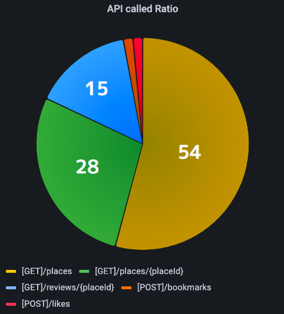

# Redis Cache Server를 이용한 성능 최적화


------


## API 요청이 집중된 메서드 발견


Log 기능을 구현한 후 저희 팀은 Log를 좀 더 쉽게 보기 위하여 Grafana를 이용하여 로그 시각화를 진행하였습니다.




그 결과 저희는 특정 메서드에 API 요청이 집중되는 현상을 확인할 수 있었습니다.

물론 저희가 진행한 프로젝트 자체에서 API 요청이 집중된다고 해서 DB에 문제가 생길 일은 없겠지만,

DB는 비싼 자원인 만큼 다양한 경험을 통해 개발자로서 조금 더 뛰어난 역량을 갖춰보자는 의견이 나왔고

CacheServer를 이용하자는 결론이 나왔습니다.


-----------------


## Redis vs Memcached


먼저 CacheServer를 운영할 Tool 선정에 대해 이야기를 나누었습니다.

저희가 쉽게 다룰 수 있는것들을 추려보았을 때 첫번째로 Redis 두번째로 Memcached가 선정되었습니다.

두 가지 Tool을 비교하였을 때 공통점과 차이점은 다음과 같았습니다.

### 공통점

- In-memory 기반으로 일반 DB에 비해 속도가 압도적으로 빠르다.
- Key-Value 저장 방식이다.
- Partitioning, Sharding 을 통하여 Data를 분산 저장할 수 있다.

### 차이점

#### Redis

- Single-thread를 지원하여 사용자가 쉽게 이해할 수 있다.
- String, Hash, Set 등 다양한 자료 구조를 활용할 수 있다.
- Master - Slave 구조를 이용하여 클러스터를 편성할 수 있다.
- Data를 Disk에 기록하기 떄문에 Data의 복구가 가능하다

#### Memcached

+ Multi-thread를 지원하여 Multi Process Core의 사용이 가능하다.
+ Data를 String Type으로 저장한다
+ Data의 복제가 불가능하다.
+ Data의 저장이 불가능하다.


결국 속도나 사용적인 측면에서는 Redis, 기능적인 측면에서는 Memcached를 사용하는 것이 좋다는 결론이 나왔습니다.

이에 팀원들과의 회의를 진행했고, 저희같은 소규모 프로젝트에 Multi-thread의 기능은 필요 없기 때문에

Redis를 이용한 CacheServer 구현을 진행하게 되었습니다.


-------


## CacheServer 구현


**ServerApplication**

```java
@EnableCaching
@EnableJpaAuditing
@SpringBootApplication
@PropertySource("classpath:env.yml")
public class ServerApplication {

   public static void main(String[] args) {
      SpringApplication.run(ServerApplication.class, args); }
}
```

가장 먼저 Caching을 사용하기 위하여 ServerApplication에 ```@EnableCaching```을 작성하였습니다.


**RedisConfiguration 클래스**

```java
@RequiredArgsConstructor
@Configuration
@EnableRedisRepositories
public class RedisConfiguration {
    private final RedisProperties redisProperties;


    public ObjectMapper objectMapper() {
        PolymorphicTypeValidator ptv = BasicPolymorphicTypeValidator
                .builder()
                .allowIfSubType(Object.class)
                .build();

        ObjectMapper mapper = new ObjectMapper();

        mapper.disable(SerializationFeature.WRITE_DATE_KEYS_AS_TIMESTAMPS);
        mapper.registerModules(new JavaTimeModule(), new Jdk8Module());
        mapper.activateDefaultTyping(ptv, ObjectMapper.DefaultTyping.NON_FINAL);

        return mapper;
    }


    @Bean
    public RedisConnectionFactory redisConnectionFactory() {
        return new LettuceConnectionFactory(redisProperties.getHost(),
                                            redisProperties.getPort());
    }

    @Bean
    public RedisTemplate<String, Object> redisTemplate() {
        RedisTemplate<String, Object> redisTemplate = new RedisTemplate<>();
        redisTemplate.setKeySerializer(new StringRedisSerializer());
        redisTemplate.setValueSerializer(new StringRedisSerializer());
        redisTemplate.setConnectionFactory(redisConnectionFactory());
        return redisTemplate;
    }

    @Bean
    public CacheManager cacheManager() {
        RedisCacheManager.RedisCacheManagerBuilder builder =
                RedisCacheManager.RedisCacheManagerBuilder.fromConnectionFactory(redisConnectionFactory());
        RedisCacheConfiguration configuration =
                RedisCacheConfiguration.defaultCacheConfig()
                                       .serializeKeysWith(RedisSerializationContext.SerializationPair.fromSerializer(
                                               new StringRedisSerializer()))
                                       .serializeValuesWith(RedisSerializationContext.SerializationPair.fromSerializer(
                                               new GenericJackson2JsonRedisSerializer(objectMapper())))
                                       .entryTtl(Duration.ofMinutes(30));

        builder.cacheDefaults(configuration);
        return builder.build();
    }
}
```


가장 먼저 Redis와의 Connection을 진행하기 위하여 ```RedisConnectionFactory``` 메서드를 작성하였고,

Redis Server와의 통신을 처리하고 올바른 값을 저장하기 위한 ```RedisTemplate``` 메서드를 구성하였습니다.


이 후 ```CacheManager```를 다음과 같이 구성하였습니다.

- ```serializeKeysWith()``` : Key에 대한 직렬화
- ```serializeValuesWith()``` : Value에 대한 직렬화
- ```entryTtl(Duration.ofMinutes(30))``` : 캐시 수명 설정


--------------------------


## Cache 적용


**PlaceController 클래스**

```java
@RestController
@RequestMapping("/places")
@Validated
@RequiredArgsConstructor
public class PlaceController {

    private final PlaceService placeService;
    private final PlaceUpdateService placeUpdateService;
    private final PlaceMapper placeMapper;
    private final DataHolder dataHolder;

	...
    
    
    @TimeTrace
    // @CacheEvict(value = "place", key = "#placeId")
    @CacheEvict(value = "places")
    @PatchMapping("/{placeId}")
    @ResponseStatus(HttpStatus.OK)
    public PlaceDto.PlaceResponseDto patchPlace(@PathVariable("placeId") Long placeId,
                                                @Validated @RequestBody PlaceDto.PlacePatchDto placePatchDto) {
        placePatchDto.setPlaceId(placeId);
        Place place = placeUpdateService.updatePlace(dataHolder.getMemberId(),
                                                     placeMapper.placePatchDtoToPlace(placePatchDto));
        return placeMapper.placeToPlaceResponseDto(place, dataHolder.getMemberId());
    }

    ...

    @TimeTrace
    @Cacheable(value = "places")
    @GetMapping
    @ResponseStatus(HttpStatus.OK)
    public PlaceDto.PageResponseDto getPlaces(@RequestParam(value = "id", required = false) Long categoryId,
                                    @RequestParam(value = "sortby", defaultValue = "") String sortBy,
                                    @RequestParam(defaultValue = "1") int page) {
        Pageable pageable = PageRequest.of(page - 1, 50);
        return placeMapper.pageToList(placeService.findPlaces(pageable, categoryId, sortBy),
                                      dataHolder.getMemberId());
    }

    @TimeTrace
    @CacheEvict(value = "places", allEntries = true)
    @DeleteMapping("/{placeId}")
    public ResponseEntity deletePlace(@PathVariable("placeId") Long placeId) {
        placeService.deletePlace(dataHolder.getMemberId(), placeId);
        return new ResponseEntity<>(HttpStatus.NO_CONTENT);
    }

}
```


```java
@Cacheable(value = "place", key = "#placeId")
```

해당 에너테이션을 적용한 클래스 또는 메서드에서 요청이 들어왔을 때,

CacheServer에 Data가 있으면 Cache Data를 반환하고, 없으면 저장을 하게됩니다.

이때 Value 값에 지정된 문자를 Cache 이름으로 저장하게 되고, Key 값을 기준으로 Cache를 구분합니다.


```java
@CacheEvict
```

해당 애너테이션을 적용한 메서드가 실행될 경우 관련된 Cache를 삭제하게 됩니다.

저희 프로젝트에서는 해당 에너테이션을 사용한 이유는 CacheServer에 Data를 저장 후 DB의 Data에 변화가 생겼을 때

서로의 Data 값이 불일치하는 정합성 문제가 발생할 수 있기 때문입니다.

결국 Cache Data의 변경 또는 삭제 등의 이슈가 진행되었을 때 관련 Cache Data를 전부 삭제하였습니다.


-----------------------


## CacheServer 적용을 통해 느낀 점


저희는 지금까지 Database는 전부 관계형 데이터베이스 시스템을 사용하였기 때문에

비관계형 데이터베이스를 처음 접하게 되었고 각각의 장점과 단점에 대해 공부할 수 있는 좋은 경험이었습니다.

또한 적용 초반 Redis에 값이 저장될 때 Bytecode로 저장되어 난항을 겪었지만 이를 직렬화/ 역직렬화를 공부함으로서

한단계 성장할 수 있었습니다.

CacheSever 도입이 성공적으로 끝났지만, 비록 실패했더라도 Database의 설계가 서비스에서 얼마나 중요한지에 대하여

공부할 수 있는 좋은 경험이었습니다.
