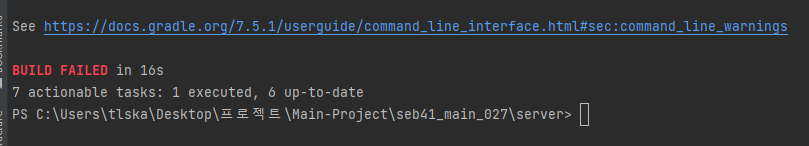
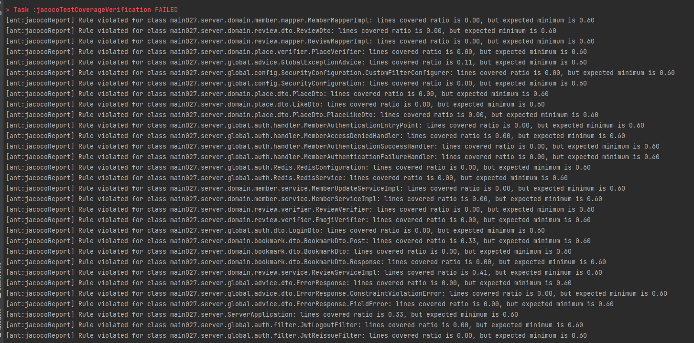
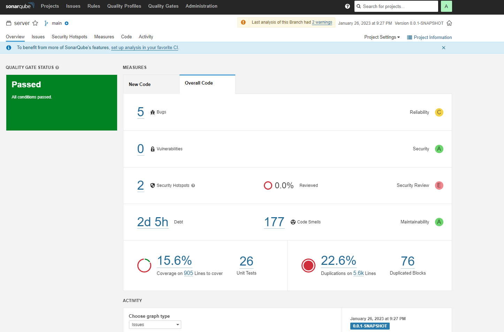
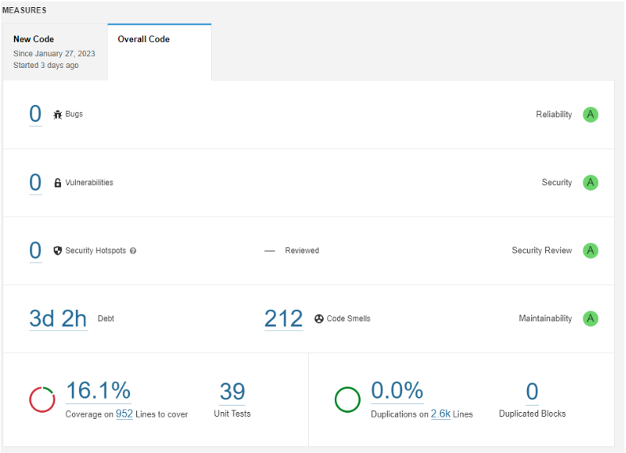

# *SonarQube를 이용한 코드 품질 개선*

------

## 코드 품질에 대해 고민하게 된 이유

Log 기능과 Cache Server를 이용하여 서비스의 성능 최적화를 진행하게 된 후 저희 팀에서는 의견이 나뉘었습니다.

서비스가 어느정도 안정되었으니 후 순위로 미뤄뒀던 기능들을 구현해보자라는 의견과 

여기서 추가적인 기능은 의미가 없으니 성능 최적화에 조금 더 힘을 실어보자라는 의견이었습니다.

그러던 중 이번 프로젝트를 진행하면서 시간관계 상 RestDocs를 작성하기 위해 Controller단에만 Test Code를 작성한

부분이 마음에 걸렸고, 서비스는 정상적으로 작동되지만 과연 저희 코드가 좋은 코드일까 라는 생각이 들어

Code Coverage와 코드 품질 개선을 진행하자고 결정되었습니다.

------

## SonarQube 적용

[Project에 SonarQube 적용하기](https://tlskals1.tistory.com/15)

코드 커버리지를 확인하기 위해 저희는 SonarQube를 적용하였습니다.

초기에는 Jacoco Code Coverage Limit 값을 60%으로 설정하고 Test를 진행하였는데 Failed가 나타났습니다.

저희 프로젝트에서 Controller를 제외하고 Test Code를 작성하지 않았기 때문에 Limit 값인 60%를 통과할 수 없었습니다.

이에 Limit 값을 지우고 현 상태의 코드 상태를 파악했습니다.

저희 프로젝트의 코드 상태는 매우 심각했습니다.

5개의 Bugs, 2개의 Security Hotspots, 15.6%의 Code Coverage 그리괴 22.6%dml 코드 중복이 검사결과로 나타났습니다.

즉 저희가 진행한 프로젝트는 그 기능들과 작동에는 문제가 없었지만, 좋은 코드가 아니라는 결론이 났습니다.

프로젝트 기간이 얼마 남지않아 저희는 개선할 수 있는 부분부터 개선하기 시작했습니다.

Bugs를 확인하여 해당 코드에서 어떠한 이상이 발생했는지 확인하고 고쳤으며,

Local에서 테스트하기 위해 작성한 csrf.disable() 메서드가 보안상의 문제가 될 수 있다는 점도 인지하였습니다.

전체적인 Code Coverage를 높이기에는 시간이 많이 부족함을 느꼈고, 먼저 중복코드를 제거 후 Code Coverage를 높이기로

결정되고, 각자 구현했던 도메인을 맡아 중복코드를 제거하였습니다.

그 결과 저희는 모든 Bugs와 Security Hotspots 그리고 코드 중복을 제거할 수 있었습니다.

-------

## SonarQube 적용을 통해 느낀 점

프로젝트가 완료된 지금에도 많은 아쉬움이 남습니다.

코드를 작성할 때 Test Code를 작성하고 진행했다면, 즉 TDD 방식으로 개발을 진행했다면

시간을 조금 더 단축시킬 수 있지 않았을까?

우리가 만든 프로젝트가 좋은 코드라고 자부할 수 있지 않았을까?

이러한 아쉬움은 저에게 TDD 개발 방식에 대한 열정을 불어넣었고, Unit Testing이라는 책을 읽는 계기가 되었습니다.

책을 읽으며 아래의 글귀가 와닿았습니다.

#### *커버리지 지표는 좋은 부정 지표이지만 나쁜 긍정 지표이다. 커버리지가 낮다는 것은 문제의 징후이지만, 커버리지가 높다고 해서 테스트 스위트의 품질이 높은 것은 아니다*.

Code Coverage에 중점을 두고 Test Code를 작성하는 것은 좋은 방법이 아니다.

그저 참고하되, 이것을 개발의 지표로 삼지 말라는 말이었습니다.

Test란 저에게는 참으로 어려운 개념이었습니다. 하지만 그만큼 깨달은 바도 많은 책이었습니다.

이를 바탕으로 다음 프로젝트를 진행할 때 TDD 방식을 최대한 지향하여 개발하고

지금의 프로젝트와 비교해 보자라는 목표가 생겼습니다.

